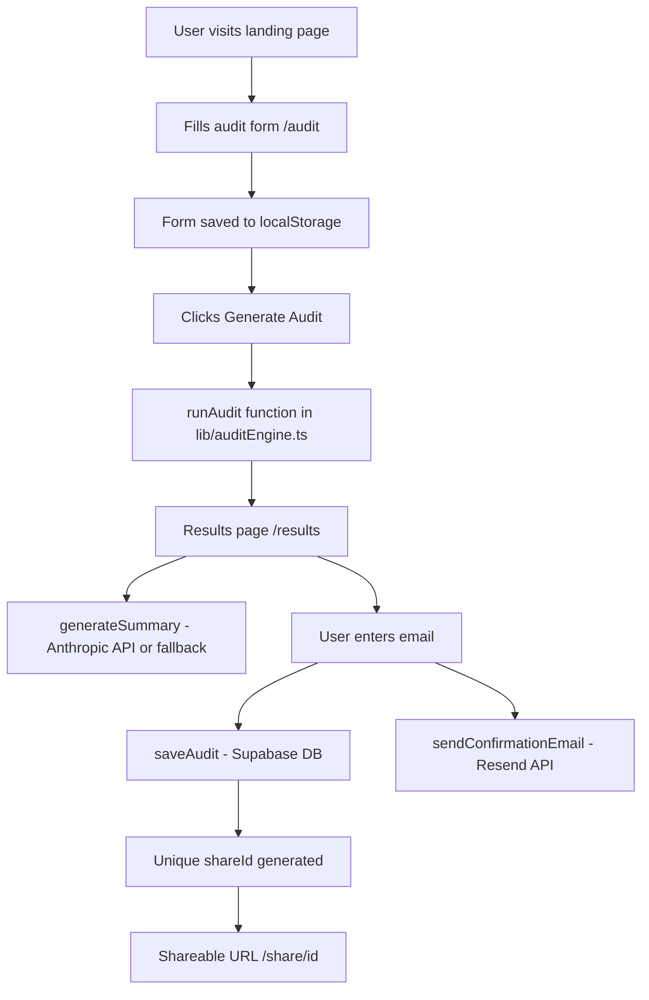

# Architecture

## System Diagram

## Data Flow

1. User fills form → saved instantly to localStorage
2. On submit → localStorage data passed to `runAudit()`
3. `runAudit()` applies pricing rules → returns savings breakdown
4. Results rendered on screen
5. User enters email → `saveAudit()` saves to Supabase
6. `generateShareId()` creates unique 8-char ID
7. Email sent via Resend with share link
8. Share page `/share/[id]` fetches from Supabase by shareId

## Why This Stack

- **Next.js 15** — App Router, API routes, server components all 
  in one. Perfect for a full-stack app with a 7-day deadline.
- **TypeScript** — Catches pricing data bugs at compile time. 
  Critical when numbers drive business decisions.
- **Supabase** — Postgres with a REST API out of the box. 
  No ORM setup needed, fast to ship.
- **Tailwind CSS** — No context switching between CSS files. 
  Keeps UI iteration fast.
- **Resend** — Best developer experience for transactional email. 
  Simple API, reliable delivery.
- **Vercel** — Zero config deployment for Next.js. 
  CI/CD built in.

## Scaling to 10k Audits/Day

Current architecture handles hundreds of audits/day comfortably.
For 10k/day these changes would be needed:

1. **Rate limiting** — Add Redis-based rate limiting on the 
   `/api/send-email` route to prevent abuse
2. **Supabase connection pooling** — Enable PgBouncer in Supabase 
   settings to handle concurrent DB connections
3. **Edge caching** — Cache share pages at the CDN level since 
   they are read-only after creation
4. **Queue emails** — Move email sending to a background job queue 
   like Inngest to avoid blocking the API response
5. **Analytics** — Add PostHog or Mixpanel to track conversion 
   funnel at scale