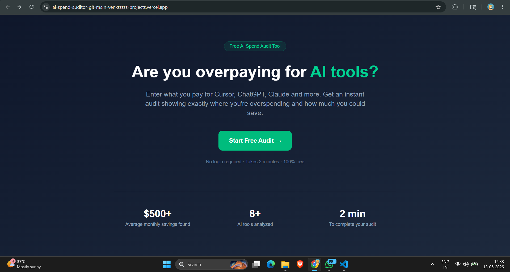
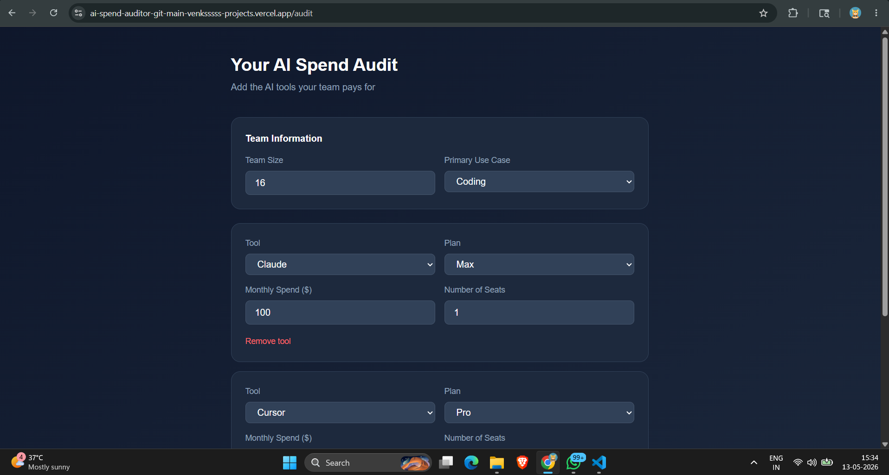
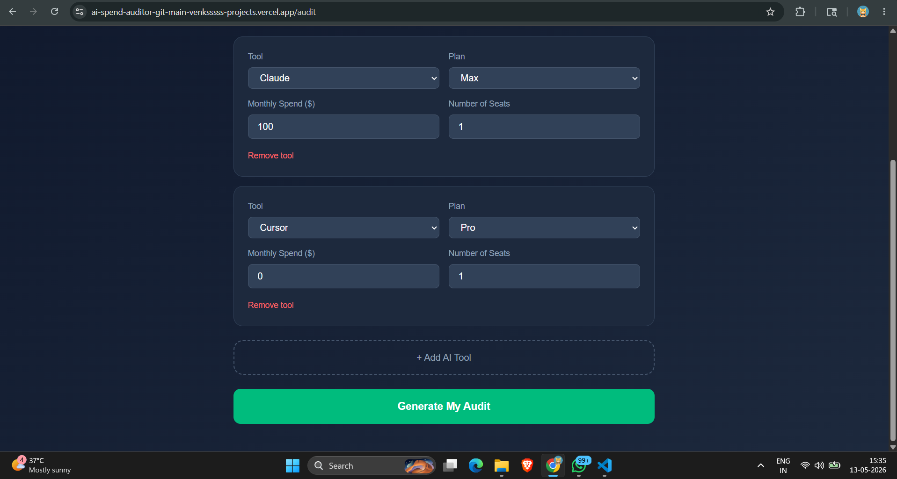
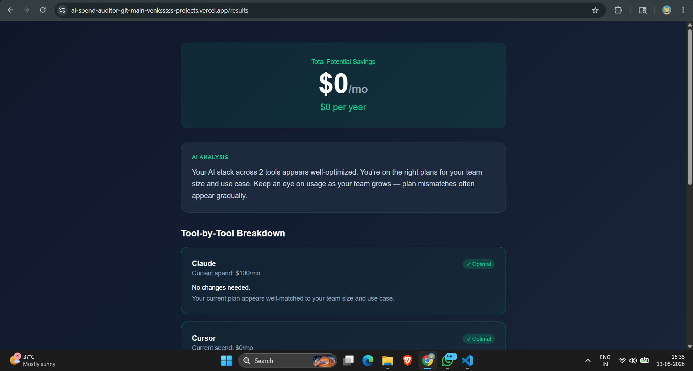
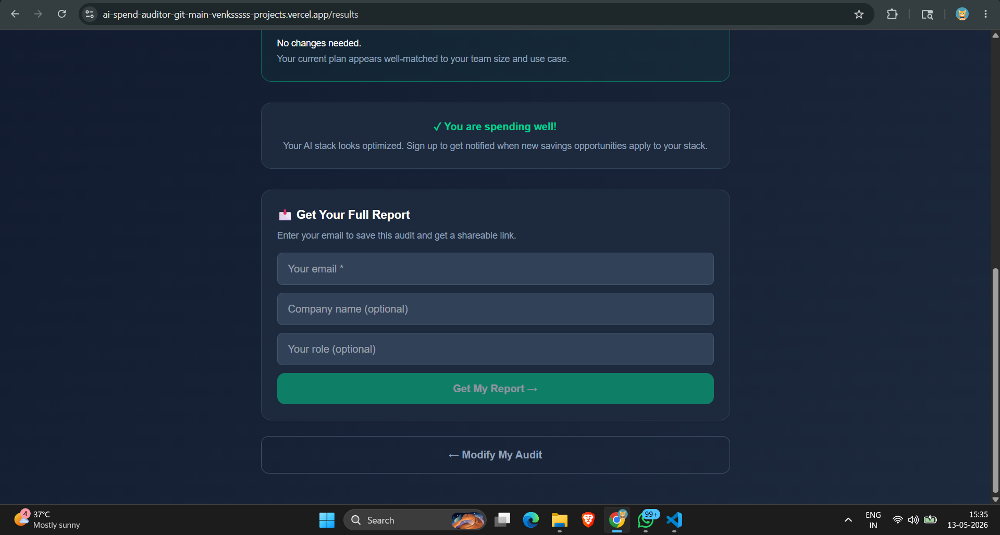

# AI Spend Auditor

A free web app that audits your team's AI tool spending and shows 
you exactly where you're overspending and how much you could save.
Built as a lead-generation tool for Credex, which sells discounted 
AI infrastructure credits.

## Screenshots







## Quick Start

### Install
```bash
git clone https://github.com/Venksssss/AI-Spend-Auditor.git
cd AI-Spend-Auditor
npm install
```

### Environment Variables
Create `.env.local` with:
NEXT_PUBLIC_SUPABASE_URL=your_supabase_url
NEXT_PUBLIC_SUPABASE_ANON_KEY=your_supabase_anon_key
RESEND_API_KEY=your_resend_api_key
NEXT_PUBLIC_APP_URL=http://localhost:3000

### Run Locally
```bash
npm run dev
```

### Deploy
Push to GitHub. Connect to Vercel. Add environment variables.

## Live URL
https://ai-spend-auditor-n3sqtuny2-venksssss-projects.vercel.app

## Decisions

1. **Next.js over plain React** — Built-in API routes meant I didn't 
need a separate backend for email sending. One codebase, one deploy.

2. **Supabase over Firebase** — Postgres is more familiar to finance 
people reviewing the data. Better SQL querying for audit analytics.

3. **Hardcoded audit rules over AI** — The assignment was right. 
A finance person needs to trust the math. AI-generated savings 
numbers would be unpredictable and hard to defend.

4. **Resend over SendGrid** — Much simpler API, generous free tier, 
and the developer experience is significantly better for a 7-day build.

5. **localStorage for form persistence** — No login required by design. 
localStorage keeps the form state across reloads without any backend 
call, keeping the experience fast and private.

6. **Honeypot over CAPTCHA for spam protection** — CAPTCHAs hurt 
conversion. A honeypot hidden field catches bots silently without 
any friction for real users.
